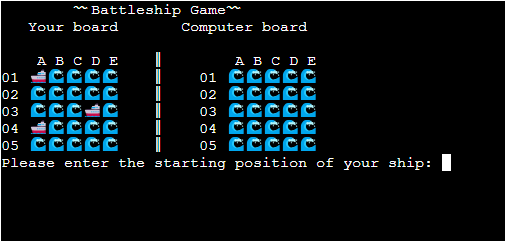

# Rock Paper Scissors

ho3-battleship is a Python terminal game, which runs in the mock terminal on Heroku

Users can try to beat the computer by finding all of the computer's battleships before the computer finds theirs. Each battleship occupies one cell or more on board respecting to the user grid selection at the start of the game.

## How to play

ho3-battleship is based on classic pen-and-paper game. You can read more about it on [Wikipedia](https://en.wikipedia.org/wiki/Battleship_(game)).

In this version, the player can choose between three size of the grid.

After choosing the grid size you should setup your ship's positions. And also computer generating random position for it's ships that you can't see them on it's board.

Now the game has begun and you should guess the positions of the computer's ships each turn. Of course computer will try to guess your ship's positioning and you should find the before the computer.

When you or computer sink all of their opponent's ships the winner will be announced.

## Features

- __Instruction of the game__

    - There is an instruction for the game that user understand the rule of the game. User also should chosse the size of the grid.

- __Ship Location__

    - After choosing the size user should start positioning his/her ships on the board. After choosing a position you can see the ship emoji on your board.

- __Shooting each other__

    - Now the fun has begun. User should try to guess the position of the computer's ships if the user hit you can see a flame emoji on the board, if the user miss there will be a cross emoji on the board.

- __Winner or Loser__

    - When any opponent manage to sink all of the opponent's ships the winner will be announced and ask the user that if he wants to play the game again or quit.

### Existing Features

- __Starting view features__

  - Featured at the top of the strating view page, the area field for you to choose your username.

  - After choosing your username you have three options which are Best of One (The player or the computer have one chance to win or lose the game.), Best of Three (The player or the computer have three chances to win the or lose the game.), Best of Five (The player or the computer have five chances to win or lose the game.).

  - There is a text field to let you know about the rules of the game.

  - After choosing your username and the match option by clicking the Start button you port to the Matching view of the game.

- __Matching view features__

  - In this view you can see the match option that you have chosen on the top of the page.

  - There is a field you can see your chose, computer choice, and the result of the round by their icons and a nice light respecting the result.

  - You can track your score, computer score, and the round counter that count the rounds which has a winner, either you or computer.

- __Ending view features__

  - After finishing the game you port to the ending view and at the top of the page there will be a thanks message.

  - Underneath of the the thanks message you can see that you were the winner or the loser.

  - In addition, you may also have two choices to return to the main menu (Starting view) or rematch the game with the same match option and username (Matching view).

## Testing

  - The project is completely responsive to all devices. In testing there were some errors (rotation screen in mobile size, the height of the container in the mobile screen) but with some searching in [Stackoverflow](https://stackoverflow.com/) fixed all of the errors.

### Validator Testing

- HTML
  - No errors were returned when passing through the official [W3C validator](https://validator.w3.org/nu/?doc=https%3A%2F%2Fho3khaleghi.github.io%2Frock-paper-scissors%2F)
- CSS
  - No errors were found when passing through the official [(Jigsaw) validator](https://jigsaw.w3.org/css-validator/validator?uri=https%3A%2F%2Fho3khaleghi.github.io%2Frock-paper-scissors%2F&profile=css3svg&usermedium=all&warning=1&vextwarning=&lang=en)
- JavaScript
  - No errors were found when passing through the official [Jshint validator](https://jshint.com/)
    - The following metrics were returned:
    - There are 26 functions in this file.
    - Function with the largest signature take 1 arguments, while the median is 0.
    - Largest function has 16 statements in it, while the median is 2.5.
    - The most complex function has a cyclomatic complexity value of 11 while the median is 1.
  

### Unfixed Bugs

  - Happily there are no bugs or errors in the project.

## Deployment

  - The site was deployed to GitHub pages. The steps to deploy are as follows: 
    - In the GitHub repository, navigate to the Settings tab 
    - From the source section drop-down menu, select the Master Branch
    - Once the master branch has been selected, the page will be automatically refreshed with a detailed ribbon display to indicate the successful deployment.

The live link can be found here - https://ho3khaleghi.github.io/rock-paper-scissors/

## Credits

  - The codes for the match option buttons and choice buttons are from [Codepen](https://codepen.io/HighFlyer/pen/WNXRZBv) with some customization respective to the need of the project.

  - The codes for the Start button and the result announcer in the ending view  are also from [Codepen](https://codepen.io/Ks145/pen/MWGxbYr) with some customization respective to the need of the project.

  - The next round announcer with is a slide in text is from [Codepen](https://codepen.io/yochans/pen/wvJXvOg) with some changes respective to the need of the project.

### Media

  - The favicon is form [Flaticon](https://www.flaticon.com/free-icon/rock-paper-scissors_6729598?k=1697965150472&log-in=google).

  - With Pixelied I converted the png file to webp. [Pixelied](https://pixelied.com/convert/png-converter/png-to-webp)

  - The background image is from [Vecteezy](https://www.vecteezy.com/vector-art/7207818-futuristic-technological-grid-background-digital-futurist-cyber-space-design-cyberpunk-technology-virtual-reality-science-fiction-matrix-science-light-perspective-wallpaper-vector-illustration).

  - The dice icons and the choice buttons icons are from [Fontawesome](https://fontawesome.com/).